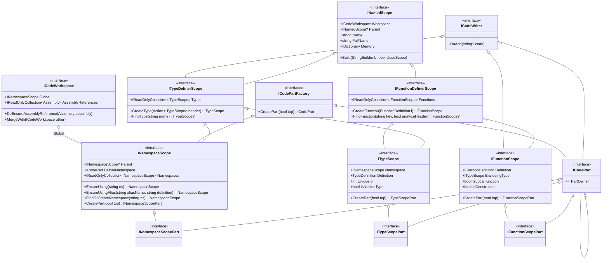

# CK.CodeGen

A mutable model of a C# source file. You do not concatenate strings into a buffer that has to be
written in order - you navigate to the namespace, the type or the method you want, and write there.
Several independent generators can fill the same file without ever meeting.

## Scopes

Everything is a scope: a named piece of source code enclosed in a parent one. The model is small and
almost entirely interfaces.



Read it as three layers. [`ICodeWriter`](ICodeWriter.cs) is *"the most basic interface: a simple string
fragment collector"* - one method, `DoAdd`. On top of it, [`INamedScope`](INamedScope.cs) adds a name, a
parent and the ability to `Build` itself into a `StringBuilder`. Then the two *definer* interfaces split
by what a scope may contain: [`ITypeDefinerScope`](ITypeDefinerScope.cs) creates types,
[`IFunctionDefinerScope`](IFunctionDefinerScope.cs) creates functions. A namespace is a type definer, a
type is both, and a function definer can nest functions - which is how local functions are modelled.

Watch the `ICodeWriter` edges rather than the names: `ITypeDefinerScope` is one, so raw code can be
dropped into a namespace or a type directly, and so is `IFunctionScope`, so a method body is written the
same way. `IFunctionDefinerScope` is **not**, even though its own summary claims *"It is itself a
`ICodeWriter`: raw code can be appendend to it as needed"* - the declaration is
`IFunctionDefinerScope : INamedScope`. In practice this costs nothing, since both types that implement
it are writers by the other route; it only means you cannot append through a variable typed as the
definer interface itself.

`INamedScope.Memory` is a plain dictionary hanging off each scope, and
[`MemorizeOnce`](NamedScopedExtensions.cs) is its idiomatic use: it returns true the first time a given
key is seen on that scope. When several generators may each want to emit the same helper method into the
same type, that is how the first one wins and the others skip.

## Parts, and why the model is not a string builder

The last row of the diagram is the reason this package exists.
[`CreatePart`](ICodePartFactory.cs) opens a **segment inside a scope, at the current writing position or
at its top**, and hands back something that is *both* a part and the scope it belongs to. So a part of a
type is still a type scope: it can define its own types, its own methods, and its own parts.

```csharp
ITypeScope t = ns.CreateType( "public sealed class Foo" );
ITypeScopePart fields = t.CreatePart( top: true );   // reserved now, filled later
t.Append( "public Foo() {}" ).NewLine();
// ... much later, from unrelated code:
fields.Append( "readonly int _id;" ).NewLine();
```

Everything ends up in the right place at `Build` time. That is what lets several code generators
contribute to one type without ordering constraints between them - the alternative, a single sequential
writer, forces the generators to agree on who writes when.

`INamespaceScope.BeforeNamespace` is the extreme case: a part that addresses the space *above* the
namespace declaration, which for the global namespace is the top of the whole file.

## Appending values, not strings

[`CodeWriterExtensions`](CodeWriterExtensions.cs) is where most of the daily API lives, and the
distinction it draws is worth internalizing:

- `Append( string )` appends **raw C# code**.
- `AppendSourceString( string )` appends the **source representation** of that string - quotes,
  escaping, the `null` keyword for a null reference.

The same treatment covers every primitive, `Guid`, `DateTime`, `TimeSpan`, `DateTimeOffset`, enums,
`Assembly` (as a `System.Reflection.Assembly.Load(...)` call), `MemberInfo`, and a general
`Append( object? )` that dispatches on the runtime type. Type names get their own family:
`AppendCSharpName`, `AppendGlobalTypeName` (the `global::`-qualified form) and `AppendTypeOf` which
writes `typeof(...)`.

Two helpers exist purely so that generated code can be traced back to its generator, using
`[CallerFilePath]`, `[CallerLineNumber]` and `[CallerMemberName]`. Both take a `format`, and their
defaults differ:

- `GeneratedByComment()` writes a star comment - `"Generated by {0}, line: {1} (method {2})."`
- `Region()` returns an `IDisposable` that wraps the code written inside it in a `#region` named
  `"Generated by '{2}' in {0}, line: {1}."`

In both, `{0}` is the generator's file path, `{1}` its line number and `{2}` its method name.

When you are staring at a 20 000-line generated file, these are not decoration.

## Definitions

A scope's header is not a string once it is parsed. [`TypeDefinition`](TypeDefinition/TypeDefinition.cs)
carries the modifiers, base types, attributes and type-parameter constraints; the
`ITypeScope.Definition` is mutable *except* its `Name`, which identifies the type inside its namespace.
[`FunctionDefinition`](FunctionDefinition.cs) does the same for methods and constructors - a
constructor is simply a function whose `ReturnType` is null - and exposes a `Key` used by
`FindFunction`. Around them sit [`TypeName`](TypeDefinition/TypeName.cs),
[`ExtendedTypeName`](TypeDefinition/ExtendedTypeName.cs),
[`TupleTypeName`](TypeDefinition/TupleTypeName.cs) and
[`AttributeCollection`](TypeDefinition/AttributeCollection.cs).

Only `FunctionDefinition` exposes a public `Parse`/`TryParse`. The rest are built by `internal` matchers
in [InternalImpl/SimpleParser](InternalImpl/SimpleParser/StringMatcherExtensions.cs) - the string-taking
`CreateType` and `CreateFunction` go through them, so a header is still written as source text, but
there is no public parser for a type name on its own.

## Nullable reference types, resolved

C# nullable annotations are metadata scattered across `NullableAttribute` and `NullableContextAttribute`
byte flags - painful to read correctly, and impossible to read at all without walking the generic
arguments in the right order. [`NullableTypeTree`](NullableType/NullableTypeTree.cs) does that walk once
and returns an immutable tree: for every node, the `Type`, its
[`NullabilityTypeKind`](NullableType/NullabilityTypeKind.cs), and its subtypes.

Two details you will meet:

- For a `Nullable<T>` the node's `Type` is **the inner type**, not the generic wrapper.
- Long value tuples nest at the eighth position. `RawSubTypes` shows the nesting; `SubTypes` flattens it.

`NullableTypeTree.ObliviousDefaultBuilder` is a settable static hook, and its default already applies
one correction for you: when the type is a `Dictionary<,>` or `IDictionary<,>` and the key is a nullable
*reference* type, the key node is turned back to non-nullable.

## Workspace and project

[`ICodeWorkspace`](ICodeWorkspace.cs) is the root: a `Global` namespace plus the set of referenced
assemblies. It raises `NamespaceCreated`, `TypeCreated` and `FunctionCreated`, and `MergeWith` folds
another workspace into it. [`CodeWorkspace`](CodeWorkspace.cs) is the static entry point:
`Create()`, `CreateProject()`, and the `Factory` field - a ready-made `Func<ICodeWorkspace>` for
consumers that need to create workspaces on demand rather than receive one.

One consequence of merging worth knowing: `ITypeScope.UniqueId` is handed out by the workspace, and when
two workspaces are merged and both define the same type, **the primary workspace keeps its own
identifier**.

[`ICodeProject`](ICodeProject.cs) wraps a workspace with what a `.csproj` needs - `TargetFrameworks`,
`Sdk`, `OutputType`, `LangVersion`, explicit `PackageReferences` - and `CreateRootElement()` emits the
MSBuild XML. `UnifiedPackageReferences` merges the explicit references with the ones derived from the
workspace's assembly references, keeping the highest version of each duplicate.

## Requires.

- `CK.Core` and `CSemVer` (the latter types the package versions of `PackageReference`).

Nothing else. This package models source code and hands it back as text: it carries no compiler, and a
consumer that only needs to *generate* code never pulls one in.
